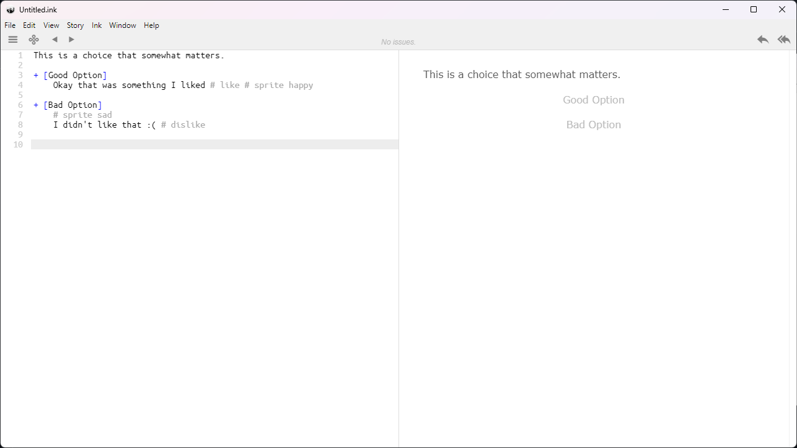

# Kasper's Guide to Writing Dialogue for This Barely Functional System

## Introduction

Hello. If you are reading this, that means that you have been assigned the task of writing dialogue for <i>Blooming Love: A Symbiotic Dating Simulator™</i>. Or you are just reading this for fun. Or you are Risto Koskenkorva reading this after the sprint week, in which case hello Risto.

Regardless, this is the guide to doing that. Hopefully it will be of help.

## Prerequisites

First of all, the dialogue system uses ink <i>(not the liquidy kind)</i>, so you should probably have the [Inky](https://github.com/inkle/inky/releases/tag/0.14.1) editor downloaded.

Next, if you want to see what the dialogue looks like in-game, you should have the Unity project cloned on your computer from the GitHub repository. You probably should have learned this in GP class, but if you didn't, [I don't blame you](https://docs.github.com/en/desktop/adding-and-cloning-repositories/cloning-and-forking-repositories-from-github-desktop). 

You can also see a basic preview of the dialogue on the Inky editor so having the Unity project is technically not a requirement.

## Basic dialogue and choices

### Dialogue

Writing basic dialogue is fairly intuitive in ink. One line of text = one line of dialogue in-game. 

Example:

### Choices

Creating choices for the player is where it gets very slightly more tricky.

Basically, you need to put a + symbol behind a line of text and that will become a choice option for the player.

Then, any lines of dialogue after that and before the next + symbol (or - symbol, will get to that in a bit) will only be seen if the player has selected that choice.

Do note, that the choices will be shown with the previous line of dialogue, so it is good to have an appropriate line when showing the choices. (Something like "What will you do?")

Example:

Now, you generally want the game to continue after the player makes their first choice. 

After all the "choice paths" are finished and you want to return to the "main path", you need to put a - symbol behind the next line of dialogue. It's kinda hard to explain so uhhh hopefully this example will show it a bit more clearly

Example:

Another note is that for whatever reason, by default ink will show the choice text as a line of dialogue after selecting it. To prevent this, put the choice text inside [square brackets].

That is about all you need to know about the built-in ink functionalities. Next up, is

## The custom stuff

### Tags

Alright so pretty much all the "custom" stuff relies on ink's tag system, so to use them you need to add tags to a line of dialogue.

This can be done by adding a # symbol after or above a line of dialogue, and writing the relevant info after the # symbol.

Example:

### Adding/Removing heart points

To make the game add/remove "heart points", use the `like` or `dislike` tags.

Example:

### Changing sprite / background

To change the sprite/background, use the `sprite` or `background` tags, followed by the internal name of the sprite/background.

Alternatively, using just `s` or `b` will work.

How the "internal naming" system works is kind of hard to explain right now, as at the time of writing we do not have many "final" sprites yet but basically every sprite will have a single-word name with the corresponding emotion, so you can type something like `# sprite happy` or `# sprite disgusted` to change the character sprite.

Internal naming example:

Example:

Everything works the same way with backgrounds so `# background beach` will change the background to a beach, if it exists in the scene.

### Changing the "speaker"

To change the "speaker" (the text above the dialogue that shows the character's name), you can use the `speaker` tag, followed by the name of the character. Do note that this does not currently support spaces in character names.

Alternately, using just `p` will work.

Example:

### Load scene

If you need to load another scene mid-scene, you can use the `loadscene` tag, followed by the scene name.

Example:

`# loadscene MainMenu`

### Playing music

By default, the music will not be played automatically when starting the scene. You can use the `playmusic` tag to start playing the scene music.

Okayyyy that should be about everything for now. If more custom stuff gets implemented I'll update this if I remember to. I'll leave a fancy table at the bottom here for refrence.

## Fancy custom tags table

| Tag  | Function |
| ------------- | ------------- |
| `# like` | Increase heart points by 1  |
| `# dislike`  | Decrease heart points by 1  |
| `# sprite [sprite name]` or `# s [sprite name]`  | Change the sprite  |
| `# background [bg name]` or `# b [bg name]`  | Change the background  |
| `# speaker [name]`  | Change the "speaker"  |
| `# playmusic`  | Play the scene music  |